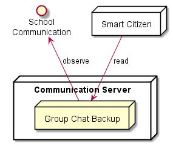

## Communication Backup Server

Communication Backup Server receives and stores all exchange communication data including messages, which can be retrieved by all participants when resuming communication sessions.

**Observed Streams**

* Cause Group Chat / Forum
