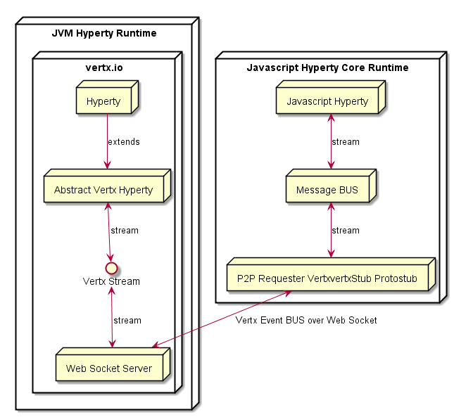
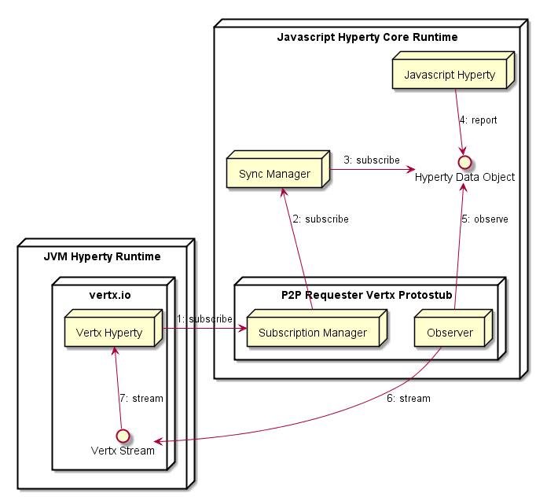
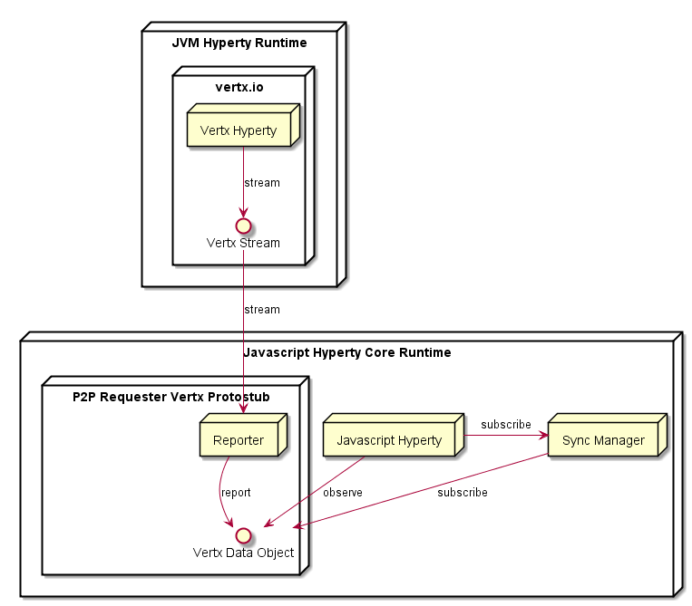

## Java based Hyperties

Hyperties in java are currently supported by using the [Vertx framework](http://vertx.io/) and an abstract java Hyperty verticle that implements some required features.

Interoperability with javascript core runtime Hyperties are currently supported by using a P2P vertx runtime protostub i.e. communication is directly established between the javascript Hyperty runtime and the JVM Hyperty runtime without using the Message Node. The P2P vertx stub uses Vertx Event BUS over Encrypted Web Sockets to connect with JVM Vertx Hyperty Runtime, making the bridge between Vertx Event BUS and Javascript Hyperty Runtime Message BUS.

### JVM Vertx Hyperties -> Javascript Hyperties

The main data flows for Vertx Hyperties Observing Data Objects reported by Javascript Hyperties, are:

### Javascript Hyperties -> JVM Vertx Hyperties

The main data flows for Vertx Hyperties Reporting Data Objects that are observed by Javascript Hyperties, are:

