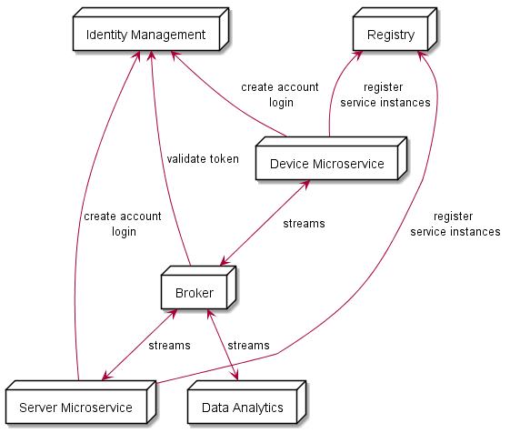
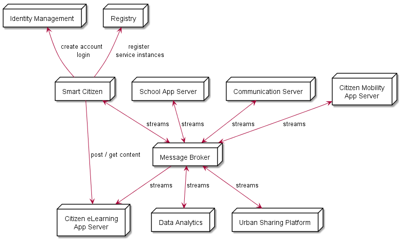
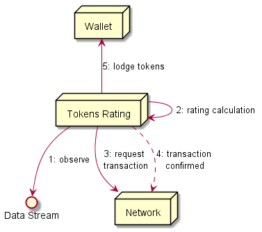
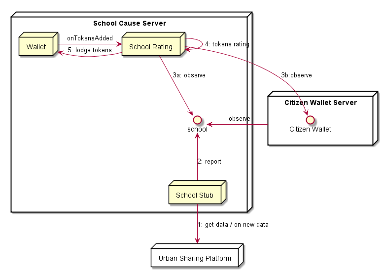
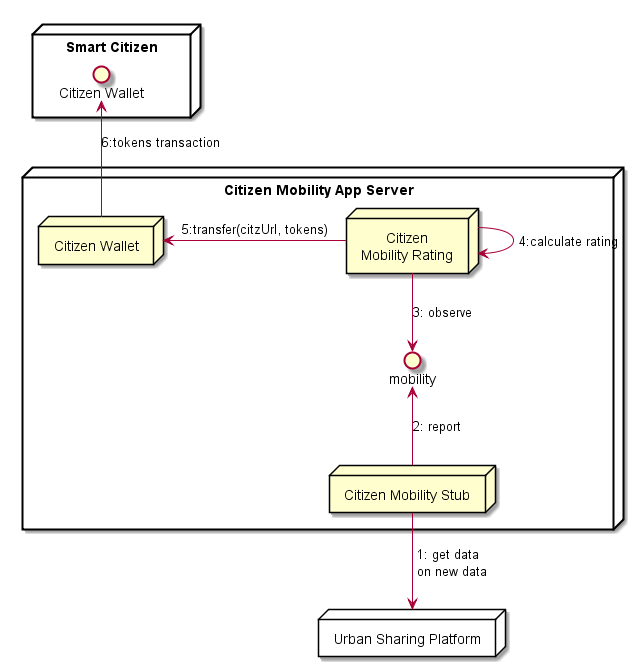
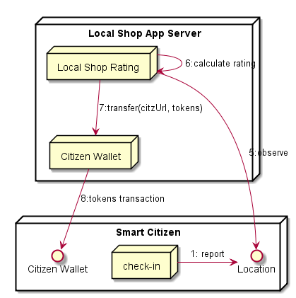
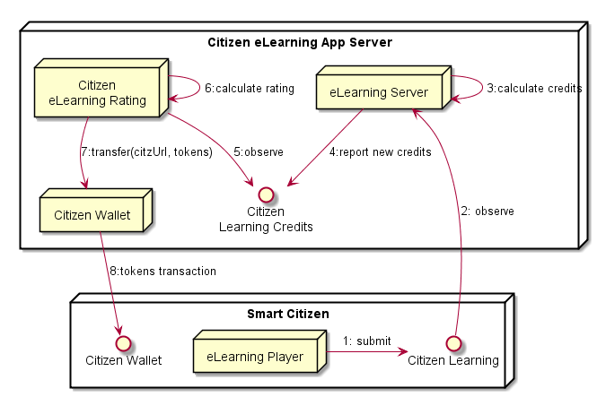
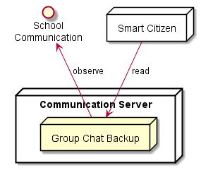
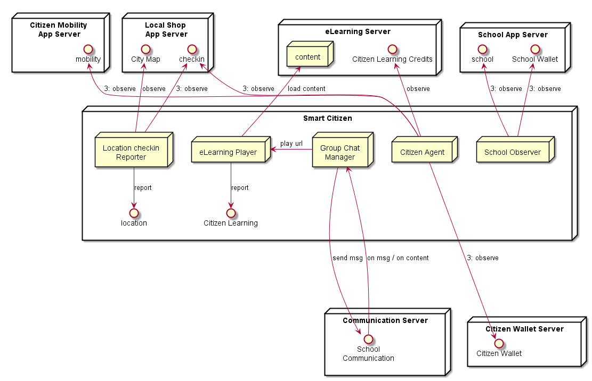

## Generic High level Service Architecture



Device Applications and App Server Apps are built on top of reusable microservices e.g. hyperties. Optionaly, when instantiated, Microservices are registered in the Registry in order to be discoverable. Authentication and Authorization are handled by external or native Identity Providers that should be compliant with [OIDC](http://openid.net/connect/).

Microservices communicate each other through streams (pub-sub) handled by the Message Broker. Request-response communications should also be supported by the Message Broker.

*todo:* add relationship token validation between microservice and idm

## Digital Social Market (DSM) High Level Architecture



DSM follows the above generic microservices architecture where systems integrated by Urban Sharing Platform APIs are encapsulated by a few backend microservices.

It should be possible to let Citizens or any other entity produce their own streams that can be routed towards the smart city platform (tokens as incentives?). This means there are microservices (Hyperties) encapsulating Iot resources (sensors and actuators) running in the device that interacts with Smart City platform when authorized by the user.

Required KPIs are published in the Data Analytics server (e.g. connected citizens and connected businesses) also as streams. There should also be microservices to consume processed data from data analytics.

*todo:* add wallet citizen server

## Token Mining from Data architectural pattern



*(to be reviewed according to existing blockchain related IoT architectures like [IOTA](http://iotatoken.com/IOTA_Whitepaper.pdf) )*

IoT Data streams are evaluated according to some algorithm that calculates its value in tokens (tokens rating). The generated tokens should be validated as a transaction by a decentralized network to avoid frauds like tokens generation from data already used before (to be implemented in the future). When the transaction is confirmed tokens are saved in the wallet.

TransactionsId should indicate its source and be saved in the wallet.

## Microservices lifecycle events

There are special streams used to produce microservice life cycle management related events e.g. new streams available.

- every microservice with some kind of dependency on other streams is observing the **announcements:<resource-type>** stream. See  [resource type](https://rethink-project.github.io/specs/datamodel/core/hyperty-resource/)
- every time a new citizen joins the DSM, the Smart Citizen app publishes events in the **announcements:<resource-type>** stream announcing a new set of streams with an IDTOKEN associated
- the back-end microservice validates the Id Token with the IdP and if successful it setup the observation on the right citizen stream.

**Format:**

```
{
  idtoken: "jhhhgjg",
   events :
  [{"type": 'newstream', url: <stream address> },
  {"type": 'newsetting',"key": <setting-name>, "value": <setting-vale> },   ]
}
```

**idtoken** should include the required id to validate the citizen id. It should be compliant with OIDC.

**type** identifies the type of announcement including `newstream` and `newsetting`.

**resources** identifies the type of resources to be produced in the stream eg `location-context`. See [here](https://rethink-project.github.io/specs/datamodel/core/hyperty-resource/readme/)

**url** the stream address.

**key** name of attribute eg `cause-name`.

**value** value of attribute eg `School-A`.

## DSM School Cause App Server

The DSM School Cause Application Server hosts the School Cause Agent where Tokens rating is performed by the School Cause Agent according to data observed from the school stub, which are lodged in the wallet.

In addition the School Rating Agent is also observing the Wallets of citizens supporting the cause and loads the School Wallet every time new tokens are loaded there. The observation of the citizen wallet is setup when there is a new citizen supporting the cause published in the **announcements** stream (should it be in a different stream dedicated to cause selection by citizens?).



*to be fixed: citizen wallet is produced by the Citizen Wallets Server (FFS)*

**Produced Streams**

* School Stream with data collected from school namely electricity consumption.

* School Wallet

**Observed Streams**

* Citizen Wallets.

## Citizen Mobility App Server

The Citizen Mobility App Server observes all citizens mobility context and asks the Citizens Wallet (loaded with previously generated tokens?) to pay the tokens to citizen.



**Produced Streams**

* Citizen Mobility with distance per session and per type of mobility including eCar, eBike, eScooter, walking, ...

## Local Shop Server

Everytime the citizen performs a local shop check-in, its location is reported, the Local Shop Rating checks the citizen location is nearby a Local Shop participating in the DSM, calculates associated tokens and saves in the Citizen Wallet.



**Observed Streams**

* Citizen Location

## eLearning Server

Each eLearning course includes:

- Elearning Content that is played by the Smart Citizen App using SAT exam model. Format proposed: section with image and a set of questions. When submitted the result is published with option selected per section.
- eLearning solution defines the right answers per section and the amount of credits per question.

The eLearning Server subscribes to Citizen eLearning stream and for each event received calculates the amount of credits and publishes it in the Citizens eLearning Credits stream that is subscribed by the eLearning Rating engine.



*todo:* eLearning player should also obseve learning credits to provide feedback to citizen.

**Observed Streams**

* Citizen Learning

* Citizen Learning Credits

**Produced Streams**

* Citizen Learning Credits

**old content**

- Content publish: subject to authorization (access token). Content should be validated and a thumbnail should be returned.
- Content types: photos, videos, quizzes, media courses defined in json as an extension of a quizz ie a quizz with an embedded video that is played at the beggining and a quizz at the end.
- Content consume: retrieve of content that is played locally.

## Communication Server

Communication Server receives and stores all exchange communication data including messages, which can be retrieved by all participants.



**Observed Streams**

* Cause Group Chat / Forum

## Smart Citizen App

*to be updated*

The Citizen Agent observes citizen mobility data retrieved from the USP and updates Citizen's Context.

In addition the Citizen Agent also updates Citizen's context with location data eg when the citizen checkin in a local shop is performed.

Citizen's context is monitored by the Citizen Rating Server and rates its performance in tokens, that are transferred to citizen's wallet.

The social timelines / newsfeed (messages exchange, eLearning content) is implemented by the Group Chat Manager. The eLearning content material URL shared in the Group Chat is used by the Application to download and play the content.



**Observed Streams**

* Citizen Wallet
* School
* Citizen Mobility
* Citizen

**Produced Streams**

* Citizen Location
* eLearning


**to be done:**

- citizen dashboard client of the Data Analytics server
- rewards observer


**FFS:** the eLearning Content Rating should also be in a server?


## Data Analytics Server

- logs published from Device Application and DSM Application Server (javascript client)
- Consume of KPIs to be displayed in the dashboard
- DSM specific KPIs examples:
  - number of registered citizens
  - number of currently connected citizens
  - busy hour (hour of the day with more connected citizens)
  - total amount of generated tokens
  - total amount of generated tokens per cause
  - Average amount of total generated tokens per citizen
  - ...

## Smart Business Back Office App

*to be completed*

- tokens wallet
- social timelines user (messages exchange, content teasers consume)
- consortium awards observer
- business awards reporter

## Cause Agent Back Office App

*to be completed*

- tokens wallet
- cause rewards reporter
- smart city observer
- smart citizen observer (?)
- Cause Agent observer
- Content management: provisioning of content to be shared in the social timelines
- social timelines management (mediation, reporter and content "teasers" sharing)
- business on-boarding control
- citizen on-boarding control
