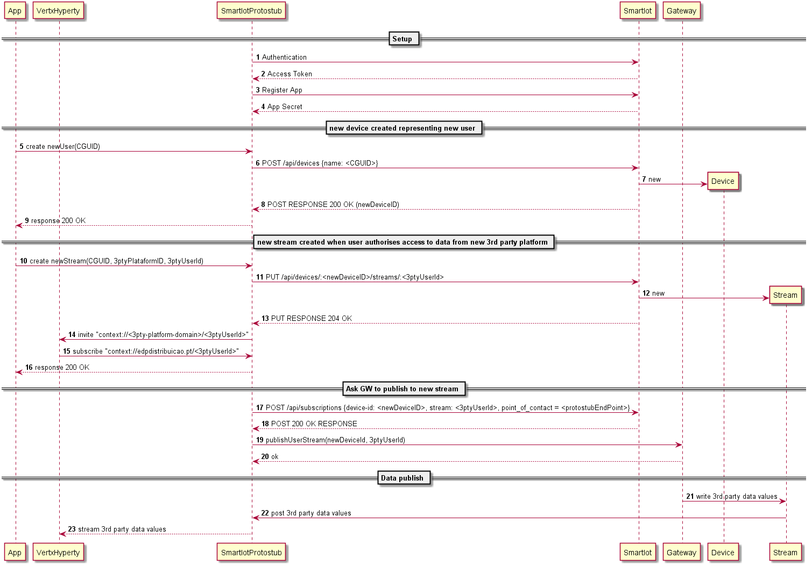

## Smart IoT Protostub

This is a Vertx Protostub component that makes the Bridge between Smart IoT message broker API and Vertx Event BUS.

See full [Smart IOT API spec](https://iot.alticelabs.com/docs/)

The device is created with user GUID and stream with the id of the external platform that is feeding the Smart IoT e.g. "edp".

For public entities like Sharing Lx Schools, the procedure is the same. In this case, the Wallet Manager Hyperty is the one that is creating the device and the stream associated to schools.

14 - 15: invitation contains the user CGUID

Protostub URL: `runtime://sharing-cities/protostub/smart-iot`