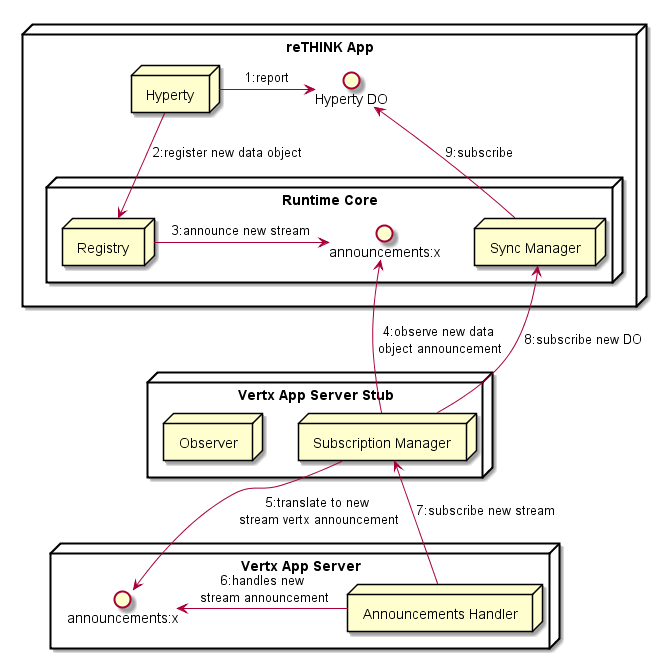

## New Data Objects announcement

*to be moved to core specs as a generic feature not just for Vertx*



This is the specification to use a new announcement broadcast feature that may be used to avoid the usage of the Domain Registry.

There is an announcement topic per resource type.

### Service Framework Syncher

On the creation of new Data Objects (`syncher.create(...,input)`), set:

`input.register = false` and

`input.announce = true`.

### Runtime Core

In this case the Runtime Core Registry will not register the new Data Object in the Domain Registry but will announce it in the announcements channel.

**Message Spec:**

```
{
  from: <runtime-registry-url>,
  to: announcements:<resource-type>,
  type: forward,
  body: {
    "type": 'newstream', url: <stream address> }
}
```

### Abstract Vertx Sync Manager

Add stream handlers and forwards it to `rate()` if rate returns a valid uint it calls `mine()` and transfers it to associated address


### private rate(data)

An empty rating engine function (separate class?) when the data evaluation in tokens is implemented according to a certain algorithm.

### private mine(int numTokens, data)

A Token miner function that generates numTokens as uint type as well as associated transaction that is stored in a DB (or the transaction is only stored in the recipient wallet ?) (future in a blockchain?):

```
{
  recipient: <wallet address of the recipient>,
  source: <data stream address>,
  date: <ISO 8601 compliant>,
  value: <amount of tokens in the transaction>
  nonce: < the count of the number of performed mining transactions, starting with 0>
}
```

*reference:* https://medium.com/@codetractio/inside-an-ethereum-transaction-fa94ffca912f

### transfer(transaction)

Publishes the transaction in the wallet address stream.

### getWalletAddress()

### getSource()

### addAnnouncementHandler()

Has an handler in the announcement address specified in the config file and calls `addStreamHandler()` or `removeStreamHandler` according to received announcement events.

### private removeStreamHandler()
