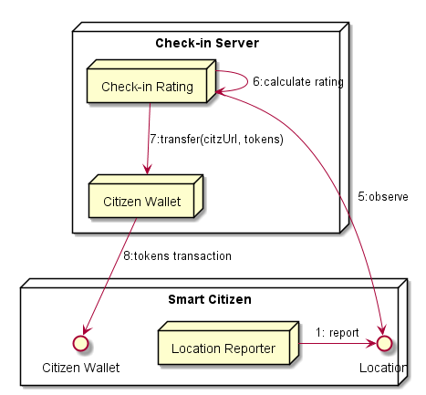

## Check-in Rating

**Address:** `hyperty://sharing-cities-dsm/checkin-rating`

Additional configuration data:

```
{
  tokens_per_checkin: <integer>,
  checkin_radius: <meters>,
  min_frequency: <hours>
}
```

The Check-in Rating Hyperty observes user's check-in location and reward with tokens the individual wallet in case it matches with some place.



### Persisted Data Model

This Hyperty handles the storage of local shops spots compliant with the [Spot Data Object Model](https://github.com/reTHINK-project/specs/tree/master/datamodel/data-objects/spot) and bonus compliant with the [E-commerce Data Object](https://rethink-project.github.io/specs/datamodel/data-objects/ecommerce/readme/?scroll=2940). Example:

**shops**

```
id: "myid",
type: "shop",
name: "Loja do Manel",
description: "A Loja do Manel é porreira",
picture: "https://xpto/manel.gif",
opening-hours: {
  monday: ['09:00-12:00', '13:00-18:00'],
  ...
  sunday: [],
  exceptions: [
    '2016-11-11': ['09:00-12:00'],
     '2016-12-25': [],
     '01-01': [], // Recurring on each 1st of january
     '12-25': ['09:00-12:00'], // Recurring on each 25th of december  ]
   }
location: { degrees-latitude: "", degrees-longitude: "" }
```
**bonus**

```
id: "myBonus",
icon: "https://xpto/manel.gif",
name: "Bonus da Loja do Manel",
description: "Este bonus pertence à Loja do Manel",
cost: 10,
spotID: "myid",
start: "2018/08/01",
expires: "2018/08/30",
constraints: {
  "period": "day",
  "times": 2
}
successfulTransactionIcon: "https://xpto/success.gif",
failedTransactionIcon: "https://xpto/failed.gif",
bonus: true
```


### Observed Streams

* Citizen Location:

- stores

### Produced Stream

* shops data: `spot://sharing-cities-dsm/shops`

* bonus data: `spot://sharing-cities-dsm/bonus`
