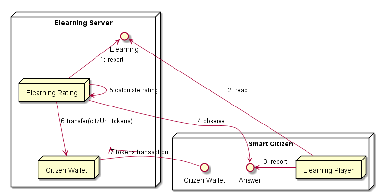

## eLearning Rating

**Address:** `hyperty://sharing-cities-dsm/checkin-rating`

Additional configuration data:

```
{
  tokens_per_checkin: <integer>,
  checkin_radius: <meters>,
  min_frequency: <hours>
}
```

The eLearning Rating Hyperty observes eLearning answers produced by user's eLearning Player Hyperty to reward with tokens the individual wallet in case the answers are correct.




### Persisted Data Model

This Hyperty handles the storage of Elearning contents compliant with the [Elearning Data Object Model](https://github.com/reTHINK-project/specs/tree/master/datamodel/data-objects/elearning).

### Observed Streams

* Citizen Elearning answers:

- data://<domain>/<identifier>

### Produced Stream

* elearning content data: `data://sharing-cities-dsm/elearning`

