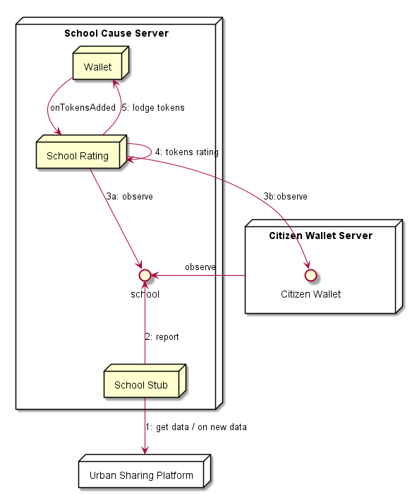

## Energy Saving Rating

**Address:** `hyperty://sharing-cities-dsm/energy-saving-rating`

The Energy Saving Rating Hyperty uses the Smart IoT stub to observe devices energy data consumption and calculate the tokens.

Two types of ratings each one having a different rating engine:

- public devices eg schools
- individual devices eg private residences

On receiving an invitation to observe a new device energy comsuption stream, the Hyperty subscribes it adding a listener to it according to weather it is a public device or a private device. The invitation should include the wallet and the type of device.



### Rating Invitation 

**handler:** <hyperty address>/`<type>` ie `hyperty://sharing-cities-dsm/energy-saving-rating/public` or `hyperty://sharing-cities-dsm/energy-saving-rating/private`.

**message:**

```
type: create,
identity: <compliant with reTHINK identity model>,
from: <energy consumption stream address>,
body: { identity: <User CGUID URL>}
```

Before the invitation is accepted, it checks there is no subscription yet for the User CGUID URL. If accepted, a listener is added to the address set in the `from` attribute.

A [Wallet address request](../wallet-manager#wallet-address-request) is performed towards the Wallet Manager to know where to transfer calculated tokens for energy savings of the new device.

### Rating handling

Rating messages follow the [DO Context update msg](https://github.com/reTHINK-project/specs/tree/master/datamodel/data-objects/context), with `WATT_PERCENTAGE` as unit

