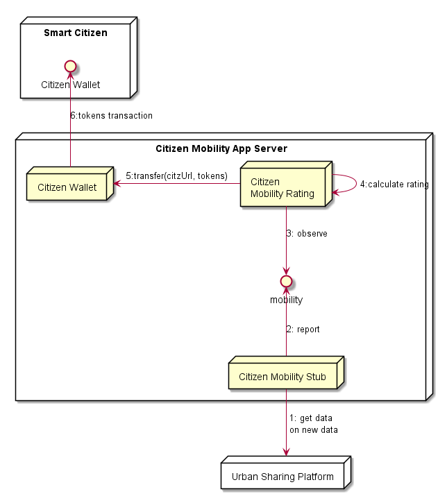

## Mobility Rating

The Mobility Rating Hyperty uses the Mobility stub to observe eco-mobility behaviors and calculate the tokens according to the algorithm defined below.

**Produced Streams**

* Citizen Mobility with distance per session and per type of mobility including eCar, eBike, eScooter, walking, ...
