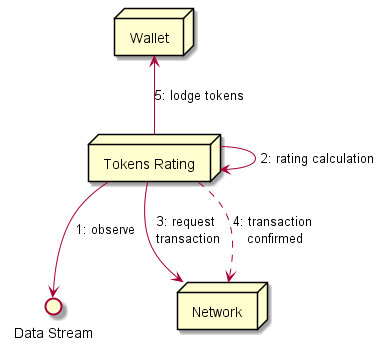

## Token Mining from Data architectural pattern

The Token Rating Hyperty evaluates IoT data according to some algorithm that calculates its value in tokens (tokens rating) e.g. to measure eco-mobility behavior of citizens in smart cities.



*(to be reviewed according to existing blockchain related IoT architectures like [IOTA](http://iotatoken.com/IOTA_Whitepaper.pdf) )*

The generated tokens should be validated as a transaction by a decentralized network to avoid frauds like tokens generation from data already used before (to be implemented in the future). When the transaction is confirmed tokens are saved in the wallet.

Currently specified Token Rating Hyerties:

* [Check-in Rating Hyperty](checkin-rating.md);
* [e-Learning Rating Hyperty](elearning-rating.md);
* [Mobility Rating Hyperty](mobility-rating.md);
* [School Rating Hyperty](school-rating.md);

## Abstract Token Rating Hyperty

There is an abstract class to be extended, that implements the token rating arch pattern introduced above.

Config file with:

* hyperty address where to setup an handler to process invitations in case the data source is dynamic eg produced by the smart citizen
* the stream address to setup the handler in case the address is static e.g. when the stream is produced via the Smart IoT.
* Wallet Manager Hyperty address.

### private addStreamHandler()

Add stream handlers and forwards it to `rate()` if rate returns a valid uint it calls `mine()` and transfers it to associated address


### private rate(data)

An empty rating engine function (separate class?) when the data evaluation in tokens is implemented according to a certain algorithm.

### private mine(int numTokens, data)

A Token miner function that generates numTokens as uint type as well as an associated transaction that is stored in a DB (or the transaction is only stored in the recipient wallet ?) (future in a blockchain?):

```
{
  recipient: <wallet address of the recipient>,
  source: <data stream address>,
  date: <ISO 8601 compliant>,
  value: <amount of tokens in the transaction>
  nonce: < the count of the number of performed mining transactions, starting with 0>
}
```

*reference:* https://medium.com/@codetractio/inside-an-ethereum-transaction-fa94ffca912f

### transfer(transaction)

Performs the transaction to Wallet Address.

### getWalletAddress(userId)

Send message to Wallet Manager address:

```
type: read,
from: <rating address>,
body: { resource: 'user/<userId>'}
```

with callback to return the value returned in case it is found.


### getSource()

### addMyHandler()

Add an handler in the Rating Hyperty address specified in the config file and calls `addStreamHandler()` for valid received invitations (create messages) or `removeStreamHandler` for valid received delete messages.

### private removeStreamHandler()
