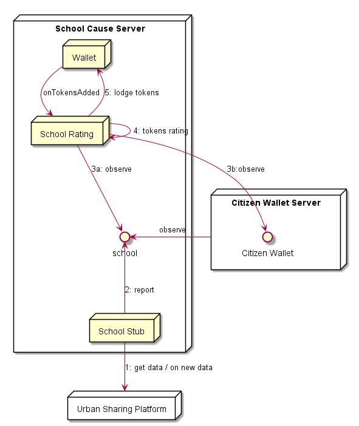

## School Rating

The School Rating Hyperty uses the School stub to observe school energy data consumption and calculate the tokens.

In addition the School Rating Agent is also observing the Wallets of citizens supporting the cause and loads the School Wallet every time new tokens are loaded there.

The Citizen Wallet is subscribed when an invitation is received.

*to be fixed: citizen wallet is produced by the Citizen Wallets Server (FFS)*

**Produced Streams**

* School Stream with data collected from school namely electricity consumption.

* School Wallet.

**Observed Streams**

* Citizen Wallets.

*to be confirmed* School Rating and Residencial are the same