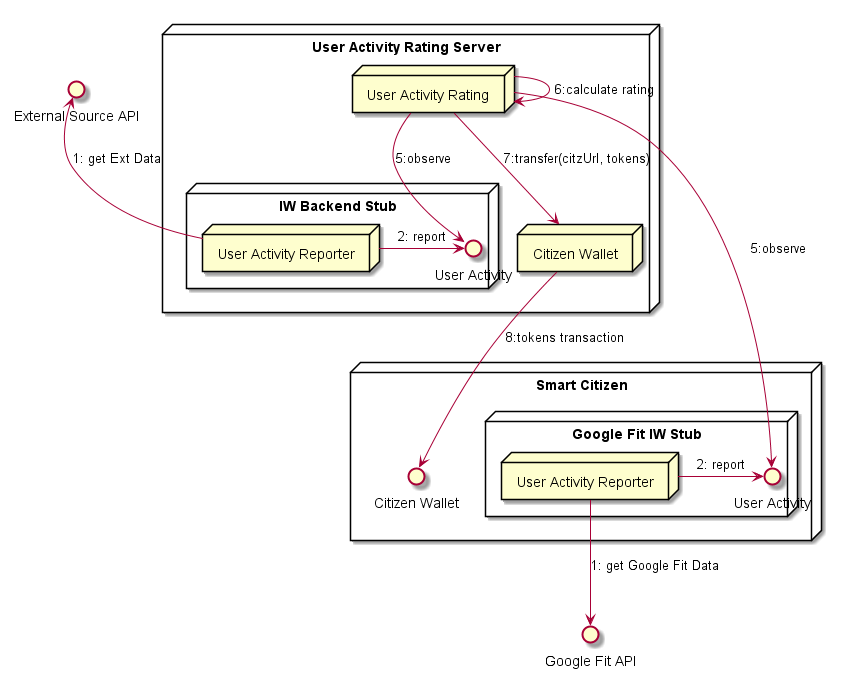

## User Activity Rating

**Address:** `hyperty://sharing-cities-dsm/user-activity-rating`

Additional configuration data:

```
{
  tokens_per_walking_km: <integer>,
  tokens_per_biking_km: <integer>,
  tokens_per_bikesharing_km: <integer>,
  tokens_per_e-driving_km: <integer>,
}
```

The User Activity Rating Hyperty observes user's activity and reward with tokens the individual wallet the following activities:

- each walked distance km is rewarded with configured `tokens_per_walking_km`
- each biking distance km is rewarded with configured `tokens_per_biking_km`
- each bike sharing distance km is rewarded with configured `tokens_per_bikesharing_km`
- each electric vehicle distance km is rewarded with configured `tokens_per_evehicle_km`



### Observed Streams

* Citizen User Activity which is a [Context Data Object](https://rethink-project.github.io/specs/datamodel/data-objects/context/readme/?scroll=2564) with types `user_walking_context` or `user_biking_context`


