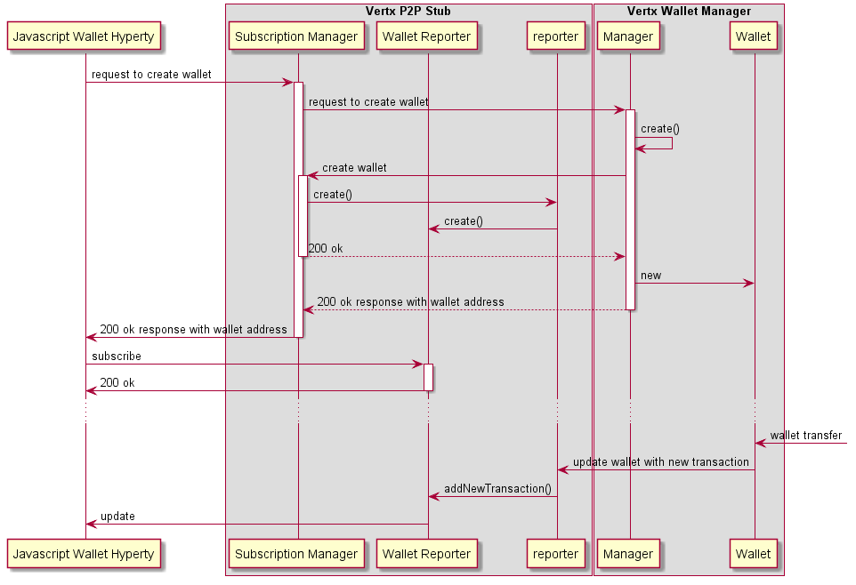

## Wallet Manager Hyperty

The Wallet Manager hyperty handles Token Wallets on behalf of a user.

### Configuration:

* `publicWallets`: list of Public Wallets to be initiated with associated Device feeds:
```
{
  address: <public wallet address>,
  identity: <wallet owner identity e.g. schoold>,
  externalFeeds: <Id of External Feeds or platforms to be Setup>
}
```
* `rankingTimer`: num of milliseconds before recalculating user rankings


For each public wallet, a new device and a new sensor is created at the Smart IoT Stub as specified [here](../smart-iot-protostub)

* `observers`: array with all vertx hyperty observers to be invited for all wallets incl. energy saving rating.

### Storage

Each wallet is store as a JSON object:

```
{
  address: <wallet address>,
  identity: <wallet owner identity>,
  created: <timestamp creation>,
  balance: <amount of token>,
  transactions: <JSON OBject. see below>,
  status: <active,deleted>,
  wallet2bGranted: <public wallet address to be granted everytime there is a new transaction>,
  profile: <JSON object with personal data about the user>,
  ranking: <int of current ranking, starting at 1>,
  bonus-credit: <credit to be spent in bonus>
}
```

Sample wallet profile:

```
{
  cause: 0,
  gender: 'm',
  ageRange: "18-25",
  livesInLisbon: false,
  worksInLisbon: true
}
```

Transaction JSON Object:
```
{
  recipient: <wallet address of the recipient>,
  source: <data stream address>,
  date: <ISO 8601 compliant>,
  value: <amount of tokens in the transaction>
  nonce: < the count of the number of performed mining transactions, starting with 0>,
  bonus: <true if bonus transaction, false otherwise>,
  data: <transaction relative data>
}
```

### Wallet creation requests

**handler:** wallet manager address.

**message:**

```
type: create,
identity: <compliant with reTHINK identity model>,
from: <wallet observer hyperty address>
```

Before the wallet is created, it checks there is no wallet yet for the identity. The Wallet Address is generated by using some crypto function that uses the identity GUID as seed and returned.

See the [reTHINK identity model](https://rethink-project.github.io/specs/datamodel/core/user-identity/).

A new entry is created in the Wallet Manager store.

An invitation is sent to `config.observers`.

If there is an associated code for the user, the `resolve-role` endpoint is called, which retrieves the following response:
```
role: <role, e.g. agent, user>
```

### Wallet address request

**handler:** wallet manager address.

**message:**

```
type: read,
body: { resource: 'user', value: <userId>}
```

### Wallet transfer

**handler:** wallet manager address.

**message:**

```
type: create,
body: { resource: 'wallet/<wallet-address>', value: <transaction JSON Object>}
```

If valid, the transaction is stored and the balance updated.

The transaction is published in the event bus sending a [Wallet update message](https://rethink-project.github.io/specs/messages/wallet-messages/).

If a `wallet2bGranted` exists, a new transfer is performed to it.

### Wallet read

**handler:** wallet address.

**message:**

```
type: read,
```

Returns the stored Wallet value.

### Wallet delete requests

**handler:** wallet manager address.

**message:**

```
type: delete,
identity: <compliant with reTHINK identity model>,
body: { resource: '<wallet address>'},
from: <wallet observer hyperty address>
```

It checks there is the wallet address for the identity and deletes from the storage.

A delete info message is sent to `config.observers`.

## How it works: Wallet Management main data flows


